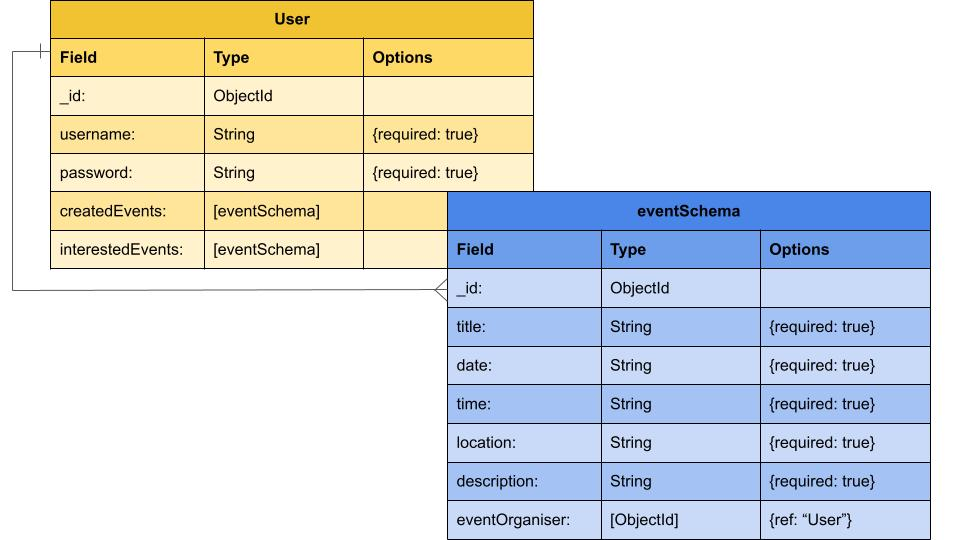

# Portell: Events for Tourists
Portello, our travel app for individuals that want to explore a new city. The app will display different events hosted for tourists.

## Goals
- Provide users with a secure way to register and log in using JWT authentication.
- Ensure users have access to a personalized dashboard tied to their unique account.
- Enable users to manage their own events (create, view, edit, delete).
- Allow users to view public events created by others, while restricting modification access.
- Design a responsive and accessible UI with protected navigation.
- Deploy the application online for real-world accessibility.
- Allow users to see other users’ profiles, while restricting modification access.
- Allow a user to see what events they’re interested in and want to take part in.

## MVP User Stories
- AAU, I want to sign up so that I can access my personalized dashboard.
- AAU, I want to log in so that I can manage my own events.
- AAU, I want to create a new event so that I can organize a future activity.
- AAU, I want to view all public events so that I can discover activities shared by others.
- AAU, I want to edit my own events so that I can update details if plans change.
- AAU, I want to delete my own events so that I can remove them if they're canceled.
- AAU, I want to see “Edit” and “Delete” buttons only on events I created so that I don’t accidentally modify someone else’s.
- AAG, I want to view events without logging in so that I can browse the app before signing up.
- AAG, I want to be restricted from creating or modifying events so that only authenticated users can manage event data.

## Features (Back end)
- JWT authentication with bcrypt password hashing and token-based session management.
- Full CRUD functionality on `Event` model tied to `User` via ObjectId.
- MongoDB/Mongoose used to manage user-event relationships.
- Front-end routing via `react-router-dom` with protected/private routes.
- Conditional rendering of UI buttons (Edit/Delete) based on user ownership.
- Fetch API used for AJAX communication between React and Express.
- Responsive layout using CSS Flexbox/Grid.

## ERD

## Stretch-goals
- The list of attendees will be shown on the event post and the event post will be visible under the user’s profile to other users. Other users cannot edit this person’s profile.
- Event creation and editing forms are pre-filled for convenience.
- Adding more cities and regions.
- Map with all the events, and redirect you to Google Maps or Apple Maps.
- Have a reminder and confirmation 24h before the event.

## Wireframes

