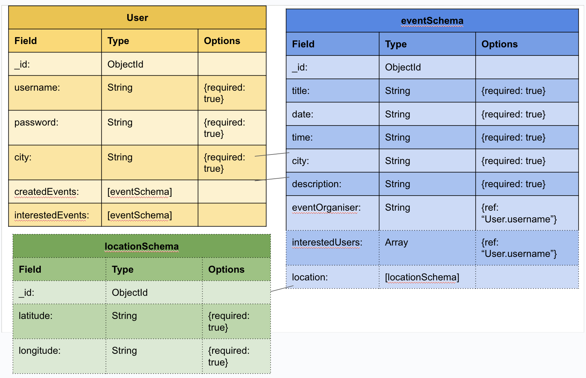
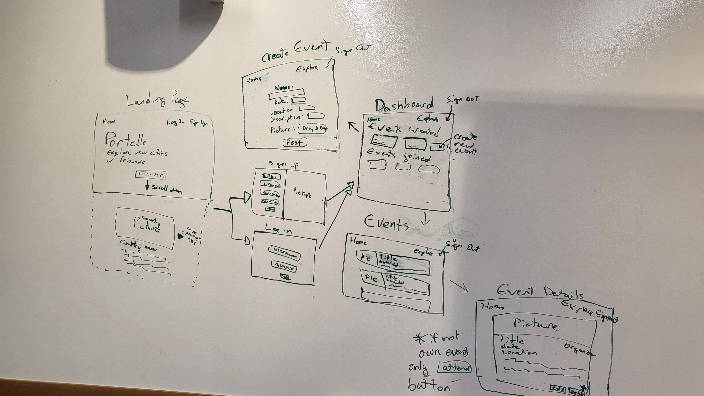
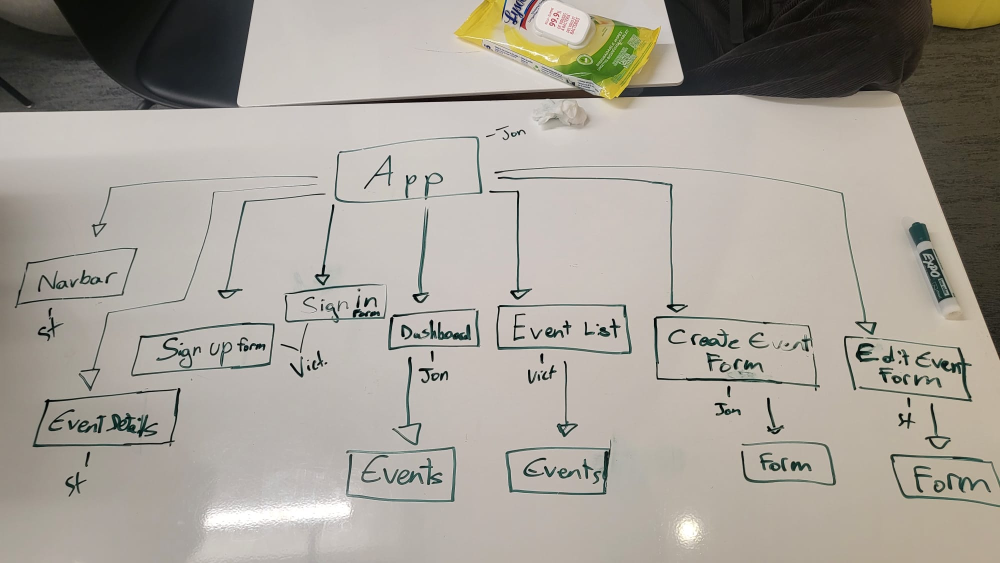

# Portelle: Events for Tourists
Portello, our travel app for individuals that want to explore a new city. The app will display different events hosted for tourists.

## MVP User Stories
- AAU, I want to sign up so that I can access my personalized dashboard.
- AAU, I want to log in so that I can manage my own events and events that I'm interested in.
- AAU, I want to create a new event so that I can organize a future activity.
- AAU, I want to view all public events so that I can discover activities shared by others.
- AAU, I want to see specific details such as date, location and description of events when selecting them.
- AAU, I want to edit my own events so that I can update details if plans change.
- AAU, I want to delete my own events so that I can remove them if they're canceled.
- AAU, I want to see “Edit” and “Delete” buttons only on events I created so that I don’t accidentally modify someone else’s.
- AAU, I want to see an "Attend" button on someone else's event post to show interest.
- AAU, I want to view other users' profiles without changing anything.

## Features
- JWT authentication with bcrypt password hashing and token-based session management.
- Full CRUD functionality on `Event` model tied to `User` via ObjectId.
- MongoDB/Mongoose used to manage user-event relationships.
- Front-end routing via `react-router-dom` with protected/private routes.
- Conditional rendering of UI buttons (Edit/Delete) based on user ownership.
- Fetch API used for AJAX communication between React and Express.
- Responsive layout using CSS Flexbox/Grid.

## ERD

## Stretch-goals
- The list of attendees will be shown on the event post and the event post will be visible under the user’s profile to other users. Other users cannot edit this person’s profile.
- Event creation and editing forms are pre-filled for convenience.
- Adding more cities and regions.
- Map with all the events, and redirect you to Google Maps or Apple Maps.
- Have a reminder and confirmation 24h before the event.

## Back End Routes
| HTTP Method | Route | Description | Controller Action | Auth Required? |
| ----------- | ----- | ----------- | ---------- |--------------- |
POST | /signup |Handle user signup | authController.signup | no
POST | /login | Handle user login | authController.login | no
GET | /events | See events in a specific city | eventsController.byCity | yes
GET | /events/new | Form to create a new event | eventsController.new | yes
POST | /events | Create a new event | eventsController.create | yes
GET | /events/:eventId | View details for a specific event | eventsController.show | yes
PUT | /events/:eventId | Edit an event | eventsController.edit | yes
DELETE | /events/:eventId | Delete an event | eventsController.delete | yes

## Wireframes

## Component Hiearchy

