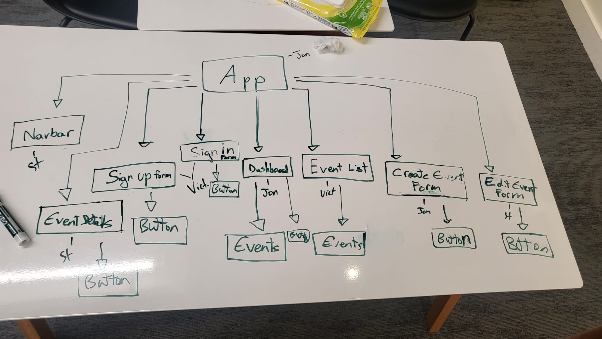

# **Portelle – Full-Stack Web App for Tourist Events**

---

## **App Description**

**Portelle** is a full-stack web application that helps tourists explore and participate in local events across different cities. Users can create events, show interest in events created by others, and manage their own events through a personalized dashboard.

This app was built to showcase full-stack development skills using the **MERN stack (MongoDB, Express, React, Node.js)** with a focus on:

- **Token-based authentication (JWT)**
- **CRUD functionality for events**
- **User authorization and event ownership control**
- **RESTful routing and protected routes**
- **Database relationships between Users and Events**
- **Clean, responsive UI/UX design**

---

## **Routes & Button Actions**

| **Method** | **Route**             | **Description**               | **Controller Action**         | **Auth Required** |
|------------|------------------------|-------------------------------|------------------------------|------------------|
| **POST**   | `/signup`              | Handle user signup            | `authController.signup`       | No               |
| **POST**   | `/login`               | Handle user login             | `authController.login`        | No               |
| **GET**    | `/events`              | Get all events                | `eventsController.byCity`     | Yes              |
| **GET**    | `/events/new`          | Form to create new event      | `eventsController.new`        | Yes              |
| **POST**   | `/events`              | Create a new event            | `eventsController.create`     | Yes              |
| **GET**    | `/events/:eventId`     | View specific event details   | `eventsController.show`       | Yes              |
| **PUT**    | `/events/:eventId`     | Edit an event                 | `eventsController.edit`       | Yes              |
| **DELETE** | `/events/:eventId`     | Delete an event               | `eventsController.delete`     | Yes              |

---

## **Wireframes & ERD Planning**

Wireframes and ERD diagrams were created using **Excalidraw** to visualize key user flows and data models.

---

### **Full Wireframe Overview**

---

### **Dashboard View (Created & Interested Events)**

---

## **Entity Relationship Diagrams (ERD)**

These diagrams display the database models and their relationships within the Portelle app.

---

### **User Model**

- **username**: `String`
- **hashedPassword**: `String`
- **city**: `String`
- **interestedEvents**: `Array of ObjectIds` referencing the Event model
- **createdEvents**: `Array of ObjectIds` referencing the Event model

---

### **Event Model**

- **title**: `String`
- **description**: `String`
- **date**: `Date`
- **city**: `String`
- **creator**: `ObjectId` referencing the User model

---

## **Technologies Used**

- **Node.js** – Backend runtime
- **Express.js** – Server and routing
- **MongoDB + Mongoose** – Database and schema modeling
- **React.js + Vite** – Front-end framework and bundler
- **JWT + bcrypt** – Authentication and password hashing
- **CSS / Flexbox / Grid** – Layout and styling
- **Render / Railway** – Deployment platforms

---

## **MVP Features**

- **User registration and JWT-based authentication**
- **Create, edit, and delete personal events**
- **View all events across cities**
- **Express interest (“Interested” / “Uninterested”) in events**
- **View Interested Events on the user dashboard**
- **Conditional rendering of event options (Edit/Delete visible only to event creators)**
- **Responsive layout for mobile and desktop**

---

## **MVP User Stories**

- **Register and log in** to access a personalized dashboard.
- **Create and manage** personal events.
- **View all public events** shared by others.
- **See detailed event information** (date, city, description).
- **Express interest in attending events.**
- **View Interested Events** under the dashboard.
- **Only event creators can edit or delete their own events.**

---

## **Stretch Goals**

- **Add list of attendees for each event.**
- **Display attended events on user profiles (read-only).**
- **Support for more cities and regions.**
- **Integrate Google Maps or Apple Maps for location-based navigation.**
- **Event reminders and confirmations (24 hours before the event).**
- **Pre-filled forms for event editing.**

---

